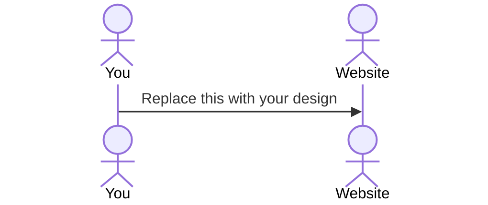

# the Game Vault

[My Notes](notes.md)

### Description
The Game Vault is an online organizer for gamers of all kinds. If you are into video games, board games, trading card games, etc., the Game Vault can help you organize them all while offering a space to share reviews, feedback, and pics of epic gaming moments. Rate the games you've played and utilize the game timer to develop healthy gaming habits. Click on your friends vaults to see what types of games they've been playing and read their reviews before deciding to get a game for yourself. 

> [!NOTE]
>  This is a template for your startup application. You must modify this `README.md` file for each phase of your development. You only need to fill in the section for each deliverable when that deliverable is submitted in Canvas. Without completing the section for a deliverable, the TA will not know what to look for when grading your submission. Feel free to add additional information to each deliverable description, but make sure you at least have the list of rubric items and a description of what you did for each item.

> [!NOTE]
>  If you are not familiar with Markdown then you should review the [documentation](https://docs.github.com/en/get-started/writing-on-github/getting-started-with-writing-and-formatting-on-github/basic-writing-and-formatting-syntax) before continuing.

## 🚀 Specification Deliverable

> [!NOTE]
>  Fill in this sections as the submission artifact for this deliverable. You can refer to this [example](https://github.com/webprogramming260/startup-example/blob/main/README.md) for inspiration.

For this deliverable I did the following. I checked the box `[x]` and added a description for things I completed.

- [x] Proper use of Markdown
- [x] A concise and compelling elevator pitch
- [x] Description of key features
- [x] Description of how you will use each technology
- [x] One or more rough sketches of your application. Images must be embedded in this file using Markdown image references.

### Elevator pitch

Did you know that the average american owns around 20 video games? That doesn't even include board games or card games! I believe I've made the perfect tool for game lovers of all kinds. It's called the Game Vault, the perfect online interface to support gamers in their quest to organize and express their love for all of their favorite games. Not only will it allow them to connect with friends, track play time, store favorite game memories, but the "game time" function also helps them develop healthy gaming habits. Gaming doesn't need to be disorganized, and with the Game Vault, the future of gaming looks secure. 

### Design

The opening sign in page keeps everyone's vaults secure, and leads into the main vault page. The main vault page has multiple racks to swipe through, exploring video games, board games, card games, and other games. Users can add games that they've purchased and games that they want to get in the future, but can only rate and leave reviews on games that they've played before. Each game can be clicked to enter the game window, where a user can leave reviews and pictures of favorite moments they've had while playing that game. The game time window is basically a countdown timer where the user defines what game they are playing and are supposed to play until the timer runs out. The color of the timer can be edited by the user. The friends window lets the user add friends and see friends vaults. 

### Key features

- Easy game organization UI which allows for reviews and ratings
- Game Timer that tracks play time and supports healthy gaming habits.
- Connect wth friends and view their game vaults, including their ratings and reviews.
- Add images of favorite moments for each game and comment on those memories.

### Technologies

I am going to use the required technologies in the following ways.

- **HTML** - Uses correct HTML structure, including 5 HTML pages; login, main vault, individual game pages, game timer, friends page.
- **CSS** - Simple clothing rack design allows user to swipe between games and scroll down to view more genres of games. Appealing individual game window layout and changeable colors for the game timer.
- **JavaScript** - Provides login functionality and keeps track of play time for each game according to the timer. 
- **React** - Each game icon is a button and users can input different star ratings, images, write reviews, and change the time details for the timer. 
- **Service** - Uses the internet to autofill the game image for whichever game the user adds to their vault. Most likely will use the "Board Game Geek" API for other game related information. 
- **DB/Login** - Stores login information and maps of the different games users add to their vaults and the information of each game. 
- **WebSocket** - When a user clicks on a friends profile, they can view that friend's vault. 

## 🚀 AWS deliverable

For this deliverable I did the following. I checked the box `[x]` and added a description for things I completed.

- [x] **Server deployed and accessible with custom domain name** - [the Game Vault](https://theGameVault.click).

## 🚀 HTML deliverable

For this deliverable I did the following. I checked the box `[x]` and added a description for things I completed.

- [x] **HTML pages** - I made a page for each part of my application. 
- [x] **Proper HTML element usage** - I formated my pages correctly with heads, headers, bodies, and footers. I don't think I really needed main tags, and I also added a variety of elements to each page. 
- [x] **Links** - I added links that take you to each page in my application and placeholder links for things I haven't learned how to implement yet. 
- [x] **Text** - I added proper text to highlight key areas of the application; very self explanatory design. 
- [x] **3rd party API placeholder** - I added a search bar to add new games based off a 3rd part API and I'll try to snatch pictures from that api to use in my UI too. 
- [x] **Images** - I added placeholder images where profile pics will go and where games will be displayed. Hopefully I can figure out how to get images from a 3rd party api based off of a user search. 
- [x] **Login placeholder** - I added a basic login and register page with nice buttons. I also added a forgot password link but it is currently not useful. Also only the Login button takes you to the next page because I haven't implemented the register button yet. 
- [x] **DB data placeholder** - In the game info page a user can write reviews, rate games, record memories and choose to favorite a game or not; all this info will be sent to a DB for safe keeping. 
- [x] **WebSocket placeholder** - The user can go to the friends page and click on a friend's link to view their vault, opening a connection to that friend's stored info. 

## 🚀 CSS deliverable

For this deliverable I did the following. I checked the box `[x]` and added a description for things I completed.

- [x] **Header, footer, and main content body** - I was able to add background color and edit the sizing and style of the texts to match my preferences.
- [x] **Navigation elements** - I made a really nice navigation bar at the top of the page that is consistent across all pages and changes color depending on what page you are on.
- [x] **Responsive to window resizing** - I was able to implement this for a couple pages but still need to go back and fix the others
- [x] **Application elements** - I made cool scroll menus to display game buttons that scroll horizontally.
- [x] **Application text content** - I centered the text and made it big enough and easy enough for the user to understand how to use the application.
- [x] **Application images** - I made use of online images as placeholders for now, but resized them to fit the flow of the application. 

## 🚀 React part 1: Routing deliverable

For this deliverable I did the following. I checked the box `[x]` and added a description for things I completed.

- [x] **Bundled using Vite** - I was able to bundle my code using vite and debug and load up pages with it succesfully. 
- [x] **Components** - I created componenets of my different pages to be displayed on button press. Because of time restraints I sadly had to cut back on the scope of my application, therefore there will no longer be a game time function. It was just going to be a glorified timer anyways. 
- [x] **Router** - I implemented routing between login and voting components.

## 🚀 React part 2: Reactivity

For this deliverable I did the following. I checked the box `[x]` and added a description for things I completed.

- [ ] **All functionality implemented or mocked out** - I did not complete this part of the deliverable.
- [ ] **Hooks** - I did not complete this part of the deliverable.

## 🚀 Service deliverable

For this deliverable I did the following. I checked the box `[x]` and added a description for things I completed.

- [ ] **Node.js/Express HTTP service** - I did not complete this part of the deliverable.
- [ ] **Static middleware for frontend** - I did not complete this part of the deliverable.
- [ ] **Calls to third party endpoints** - I did not complete this part of the deliverable.
- [ ] **Backend service endpoints** - I did not complete this part of the deliverable.
- [ ] **Frontend calls service endpoints** - I did not complete this part of the deliverable.

## 🚀 DB/Login deliverable

For this deliverable I did the following. I checked the box `[x]` and added a description for things I completed.

- [ ] **User registration** - I did not complete this part of the deliverable.
- [ ] **User login and logout** - I did not complete this part of the deliverable.
- [ ] **Stores data in MongoDB** - I did not complete this part of the deliverable.
- [ ] **Stores credentials in MongoDB** - I did not complete this part of the deliverable.
- [ ] **Restricts functionality based on authentication** - I did not complete this part of the deliverable.

## 🚀 WebSocket deliverable

For this deliverable I did the following. I checked the box `[x]` and added a description for things I completed.

- [ ] **Backend listens for WebSocket connection** - I did not complete this part of the deliverable.
- [ ] **Frontend makes WebSocket connection** - I did not complete this part of the deliverable.
- [ ] **Data sent over WebSocket connection** - I did not complete this part of the deliverable.
- [ ] **WebSocket data displayed** - I did not complete this part of the deliverable.
- [ ] **Application is fully functional** - I did not complete this part of the deliverable.
